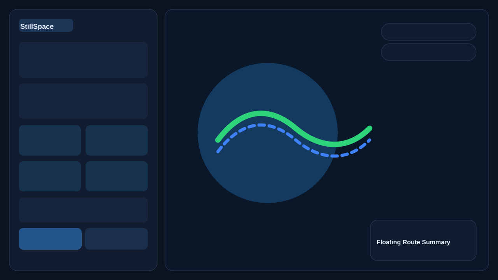

# 🌌 StillSpace: Intelligent Urban Routing

[](https://www.python.org/downloads/)
[](https://flask.palletsprojects.com/)
[](https://osmnx.readthedocs.io/)
[](https://opensource.org/licenses/MIT)

**StillSpace** is an advanced, production-ready routing engine and web application that rethinks urban navigation. While traditional navigation apps optimize purely for speed, StillSpace allows users to find the *smartest* and *most comfortable* routes based on their unique needs, comparing the absolute fastest path against intelligent, context-aware alternatives.

Whether you need a quiet stroll, a wheelchair-accessible path, a safe journey home at night, or a pleasant route for your dog, StillSpace computes the optimal path using continuous road geometries and real-world environmental data.

---

## ✨ Key Features

- 🧠 **Multi-Mode Routing Engine**: Powered by OSMnx and a custom Dijkstra-based graph search, optimizing for various comfort and safety factors over a localized `MultiDiGraph`.
- 🚶 **Smart Routing Modes**:
  - **Calm**: Minimizes stress by avoiding high-traffic highways and complex intersections.
  - **Safe**: Avoids known danger zones and isolated footpaths, prioritizing well-lit, populated roads.
  - **Accessibility**: Heavily penalizes stairs, steep inclines, and rough surfaces for a smooth wheelchair or stroller experience.
  - **Dog**: Sub-modes (`relax`, `park_priority`, `quick`) to optimize for green spaces, grass, and quiet roads.
  - **Weather-Aware**: Dynamically adjusts path weights based on real-time weather conditions (e.g., favoring sheltered paths in rain or wind).
- 🗺️ **Continuous Geometry Rendering**: Reconstructs exact street curves and bends using edge geometry, rather than rendering jagged point-to-point lines.
- 🕒 **Search History**: Integrated SQLite database to persist and manage recent searches directly from the sidebar.
- 🎨 **Premium UI/UX**: A highly responsive, dynamic Leaflet-based frontend featuring micro-animations, glassmorphism, and a mobile-friendly bottom sheet.
- 🛡️ **Mockable Environment**: Built-in cache and mock toggles for weather APIs and safety zones to ensure deterministic testing.

---

## 📸 UI Overview


*(A look at the clean, responsive mapping interface comparing the Fastest route with a Smart alternative.)*

---

## 🏗️ Architecture

StillSpace is built on a robust Python/Flask backend and a vanilla JavaScript/Leaflet frontend.

### Backend Structure
- **`app.py`**: The core Flask server, handling API endpoints, graph loading (`city.graphml`), coordinate snapping, and execution of the shortest-path algorithms.
- **`route_modes.py`**: Defines the strategy pattern for different routing modes, calculating custom weights and turn penalties based on street topology and weather.
- **`routing_utils.py`**: Helper functions for normalizing OpenStreetMap highway tags and calculating heuristic stress factors.
- **`weather_service.py`**: Connects to the OpenWeather API with an integrated LRU cache and mock data generator.
- **`database.py`**: SQLite controller managing user search history.
- **`safety_zones.py`**: Defines and evaluates geographical polygons that represent dynamically loaded danger zones.

### Frontend Structure
- **`templates/index.html`**: The semantic application shell.
- **`static/css/app.css`**: Premium styling system using modern CSS variables and flexible layouts.
- **`static/js/app.js`**: Map state management, async API calls, route drawing, and UI state machine transitions.

---

## 🚀 Getting Started (Local Development)

### Prerequisites
- Python 3.9+
- A working `city.graphml` file (generated via `download_graph.py` or provided).

### Installation Steps

1. **Clone the repository & create a virtual environment:**
   ```bash
   git clone https://github.com/yourusername/stillspace.git
   cd stillspace
   python -m venv .venv
   source .venv/bin/activate  # On Windows use: .venv\Scripts\activate
   ```

2. **Install dependencies:**
   ```bash
   pip install -r requirements.txt
   ```

3. **Configure Environment:**
   Copy the example environment file and adjust if necessary.
   ```bash
   cp .env.example .env
   ```

4. **Run the Application:**
   ```bash
   python app.py
   ```

5. **Open in Browser:**
   Navigate to `http://127.0.0.1:5000`

---

## ⚙️ Environment Variables

Customize the application behavior using the `.env` file:

| Variable | Purpose | Default |
|---|---|---|
| `FLASK_DEBUG` | Enable Flask debug mode (auto-reload) | `false` |
| `FLASK_HOST` | Host to bind the server to | `0.0.0.0` |
| `FLASK_PORT` | Port to bind the server to | `5000` |
| `LOG_LEVEL` | Python logging level (`INFO`, `DEBUG`, etc.) | `INFO` |
| `GRAPH_PATH` | Path to the OSMnx GraphML file | `city.graphml` |
| `USE_MOCK_WEATHER` | Toggle to bypass live OpenWeather API calls | `true` |
| `OPENWEATHER_API_KEY`| API key for live weather data | *(empty)* |
| `WEATHER_CACHE_TTL_SEC`| Cache expiration time for weather data | `900` |

---

## 📖 API Documentation

### 1. Calculate Smart Route
`POST /smart_route`

**Request Body:**
```json
{
  "start_lat": 30.7333,
  "start_lon": 76.7794,
  "end_lat": 30.7392,
  "end_lon": 76.7739,
  "route_mode": "calm",
  "dog_sub_mode": "relax",
  "preference_bias": 50
}
```

**Response Highlights:**
- `fastest_route`: Array of `[lat, lng]` points.
- `smart_route`: Array of `[lat, lng]` points optimized for the selected mode.
- `stats`: Distance and ETA breakdowns for both routes.
- `comparison`: Percentage differences and added time/distance.

### 2. Fetch Safety Zones
`GET /api/safety_zones`
Returns GeoJSON polygons representing simulated or real danger zones on the map.

### 3. Search History
- `GET /api/history`: Fetch recent route searches.
- `DELETE /api/history/<id>`: Remove a specific search record.

### 4. Health Check
`GET /health`
Returns system status, graph metadata, and configuration variables (useful for load balancers).

---

## 🧪 Testing & QA

Run the included smoke tests to quickly verify API health and routing integrity:

```bash
python qa_smoke.py
```
This script tests the `/health` endpoint, the safety zones, and generates mock routes for all available modes to ensure no pathfinding regressions have occurred.

---

## 🌍 Deployment

StillSpace is designed to be CPU-intensive due to graph pathfinding. Persistent containerized deployments are recommended over serverless functions.

### Running with Gunicorn (Production)
```bash
gunicorn wsgi:app --bind 0.0.0.0:5000 --workers 2 --threads 4
```

### Render / Railway Setup
1. Create a new Web Service linked to your repository.
2. **Build Command**: `pip install -r requirements.txt`
3. **Start Command**: `gunicorn wsgi:app --bind 0.0.0.0:$PORT --workers 2 --threads 4`
4. Ensure `.env` variables (like `GRAPH_PATH`) are set in the provider's dashboard.

---

## 📝 Notes & Limitations

- Graph Loading: `city.graphml` is loaded into memory entirely at startup. Ensure sufficient RAM for very large city graphs.
- Real geometry mapping guarantees that the visual route exactly tracks road curves, improving visual fidelity over standard node-to-node plotting.
